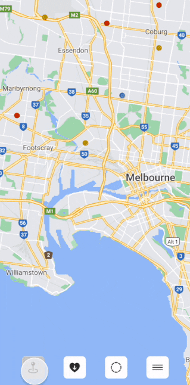

# Exposure VIC

This is a concept app that pulls data from the Victorian Government data resources to make it more accessible to where current COVID-19 exposure sites are.

## Mock-up video

## Progress video

## Features

1. Toggle locations on and off

1. Download more data

1. Set a 5km or 10km radius

1. See a list of exposure sites

## Attributions

- [Data VIC: Exposure sites](https://discover.data.vic.gov.au/dataset/all-victorian-sars-cov-2-covid-19-current-exposure-sites/resource/afb52611-6061-4a2b-9110-74c920bede77)
