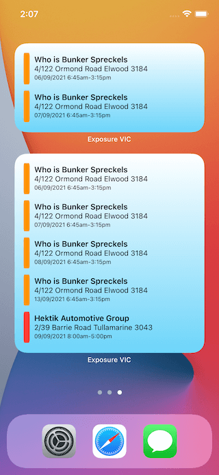

# Exposure VIC app

<em>Find exposure sites near you and keep everyone safe</em>

 

---

## Information

This is a concept app that pulls data from the [Victorian Government data](https://discover.data.vic.gov.au/dataset/all-victorian-sars-cov-2-covid-19-current-exposure-sites) resources to make it more accessible to where current COVID-19 exposure sites are.

## What and why

Apple said [developers can't submit COVID](https://developer.apple.com/news/?id=03142020a) related apps in order to stop misinformation.

So unless you're a government account, or a health entity, this app was never going to make it.

> **Guideline 5.1.1 - Legal - Privacy - Data Collection and Storage** We found in our review that your app provides services or requires sensitive user information related to the COVID-19 pandemic. Since the COVID-19 pandemic is a public health crisis, services and information related to it are considered to be part of the healthcare industry. In addition, the seller and company names associated with your app are not from a recognized institution, such as a governmental entity, hospital, insurance company, non-governmental organization, or university.

So it's here for you to install yourself.

### Requirements

- Xcode (to open the project)
- iPhone iOS 14+ / iPadOS 14+

## Installation

1. Download the zip of the project

1. Open `exposure-vic.xcodeproj`

1. Connect your iOS device

1. Run the application on there

## Features

1. See exposure sites near you

1. See information about the site

1. Share the information with someone

1. See a list of exposure sites

1. Set up radius rings for travel borders

1. Widgets with postcode filtering

## Design

### Videos

#### Mock up in Figma

#### Progress

#### Actual app

### Images

## Data

Though the data comes from Data VIC, they don't provide the coordinates to exposure sites.

In this [repo](https://github.com/markbattistella/exposure-vic-api) you can find the code that parses the JSON and geocodes it with PositionStack.

It's not 100% perfect, so there are some manual fixes done, but if you want to help, it would be appreciated!

## Attributions

- [Data VIC: Exposure sites](https://discover.data.vic.gov.au/dataset/all-victorian-sars-cov-2-covid-19-current-exposure-sites/resource/afb52611-6061-4a2b-9110-74c920bede77)

- [Ben Kaiser](https://github.com/benkaiser/covid-vic-exposure-map) for the pointers on geocoding

- [Beau Nouvelle](https://github.com/BeauNouvelle/) for fielding every iOS question

## Contributing

- Clone the repo: `git clone https://github.com/markbattistella/exposure-vic`

- Create your feature branch: `git checkout -b my-feature`

- Commit your changes: `git commit -am 'Add some feature'`

- Push to the branch: `git push origin my-new-feature`

- Submit the pull request

---

<small>Get vaccinated. Protect nan.</small>
